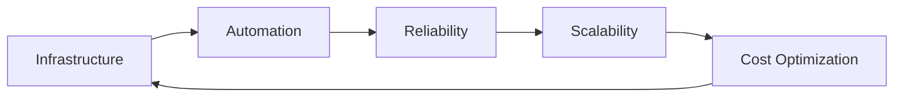

<div align="center">
  
</div>

<div align="center">
  
</div>

---

<div align="center">
  
</div>

## 🚀 About Me

```python
class VenkateshPoola:
    def __init__(self):
        self.name = "Venkatesh Poola"
        self.role = "Senior DevOps & SRE Engineer"
        self.experience = "7+ years"
        self.location = "India"
        self.passion = "Building reliable, scalable systems"
        
    def current_focus(self):
        return [
            "Multi-cloud infrastructure automation",
            "Kubernetes ecosystem contributions", 
            "CI/CD pipeline optimization",
            "Site reliability engineering"
        ]
        
    def fun_fact(self):
        return "I once debugged a production issue at 3 AM and it turned out to be a missing semicolon 😅"
```

---

## 🛠️ Tech Stack

### Languages & Scripting
<div align="center">
  
  
  
  
  
</div>

### Cloud Platforms
<div align="center">
  
  
  
</div>

### DevOps & Infrastructure
<div align="center">
  
  
  
  
  
  
</div>

### Monitoring & Observability
<div align="center">
  
  
  
  
</div>

---

## 📊 GitHub Analytics

<div align="center">
  
  
</div>

<div align="center">
  
</div>

---

## 🏆 GitHub Trophies

<div align="center">
  
</div>

---

## 💼 What I Do

I'm a DevOps engineer who's been in the trenches for over 7 years, helping teams build systems that actually work when you need them to. Here's what keeps me busy:

### 🔧 **Infrastructure Automation**
- **Multi-cloud setups**: I've wrangled AWS, Azure, and GCP into submission
- **Infrastructure as Code**: Terraform and Ansible are my go-to tools for making infrastructure repeatable
- **Container orchestration**: Kubernetes isn't just a buzzword for me - I've actually made it work in production

### 🚀 **CI/CD Pipelines**
- **Automated deployments**: Built pipelines that deploy code faster than you can make coffee
- **Quality gates**: Integrated testing, security scans, and code quality checks
- **Release management**: Made the scary process of releasing software actually predictable

### 📈 **Monitoring & Reliability**
- **Observability**: Set up monitoring that tells you what's broken before your users do
- **Incident response**: Been the person on-call at 2 AM more times than I care to count
- **Performance optimization**: Made slow systems fast and unreliable systems stable

### 🌐 **Open Source Contributions**
- **Kubernetes ecosystem**: Active contributor to CNCF projects
- **GitOps automation**: Built automation tools that other teams actually use
- **Community involvement**: Helping others learn from my mistakes (and there have been many!)

---

## 🎯 Current Focus



Right now, I'm particularly excited about:
- **Cloud-native architectures** that actually scale
- **GitOps workflows** that make deployments boring (in a good way)
- **Cost optimization** because nobody likes surprise bills
- **Team mentoring** because the best systems are built by great teams

---

## 🚀 Recent Projects

### 🔥 **Multi-Cloud Infrastructure Platform**
Built a unified platform that manages infrastructure across AWS, Azure, and GCP. The result? 40% reduction in deployment time and 60% fewer configuration errors.

### ⚡ **Kubernetes GitOps Pipeline**
Created an automated deployment pipeline using ArgoCD and Helm. Now teams can deploy to production with a simple git push.

### 📊 **Observability Stack**
Set up a complete monitoring solution with Prometheus, Grafana, and ELK stack. Incident response time dropped by 70%.

---

## 📈 GitHub Activity

<div align="center">
  
</div>

---

## 🎮 Fun Stats

<div align="center">
  
</div>

---

## 🤝 Let's Connect!

<div align="center">
  
</div>

<div align="center">
  <a href="https://www.linkedin.com/in/venkatesh-s-8b545183" target="_blank">
    
  </a>
  <a href="mailto:venkateshpoola20@gmail.com" target="_blank">
    
  </a>
  <a href="https://github.com/iam-venkateshpoola" target="_blank">
    
  </a>
  <a href="https://dev.to/venkateshpoola" target="_blank">
    
  </a>
  <a href="https://medium.com/@venkateshpoola" target="_blank">
    
  </a>
</div>

---

<div align="center">
  
</div>

<div align="center">
  
</div>
